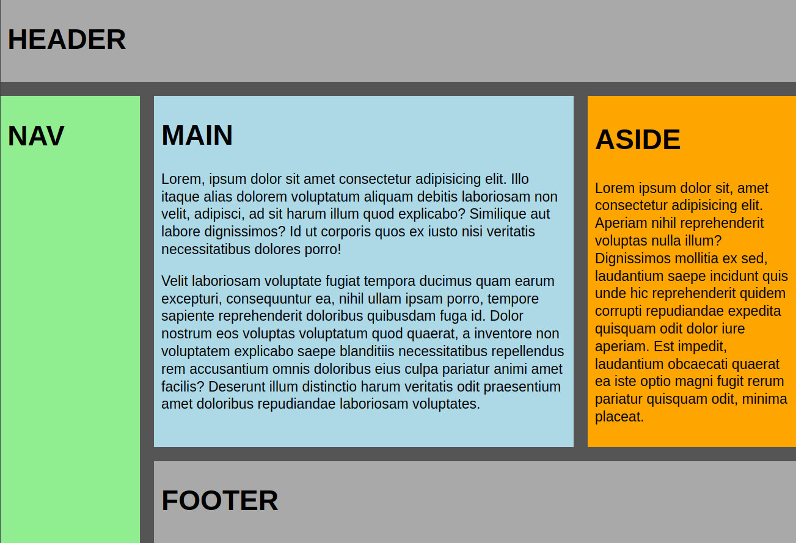

# The Day

## Smalltalk - Efficiency

[Clean Code]()
[VS-Code "Tips and Tricks"](https://code.visualstudio.com/docs/getstarted/tips-and-tricks)

# CSS-Grid

## Grid Use Cases

- Photo Gallery
- Blog Page

## CSS Grid on parent elements

- Making our grid container: `.container { display: grid }`
- Grid columns: css `grid-template-columns` and `fr` unit
- Spacing columns and rows - `gap`

### Discussion

- use cases for responsive behaviour via css `minmax([min], [max])`

### Exercises

- photo-gallery
- given mockup as screenshot by designer (and some assets)

## CSS Grid on child elements

- Spanning over several columns:
  `grid-column: [start] / [end];`, `span` keyword
- Spanning over several rows: `grid-row: [start] / [end];`

## Defining grid areas

- Template areas: setting the parent with keywords, css `grid-template-areas`
- Placing boxes in an area: css `grid-area`

## Links

- [Tutorial: CSS-Grid (DEU; selfhtml)](https://wiki.selfhtml.org/wiki/CSS/Tutorials/Grid)
- [CSS Grid Layout (ENG; MDN)](https://developer.mozilla.org/en-US/docs/Web/CSS/CSS_Grid_Layout)
- [CSS Grid Layout Module (w3schools)](https://www.w3schools.com/css/css_grid.asp)
